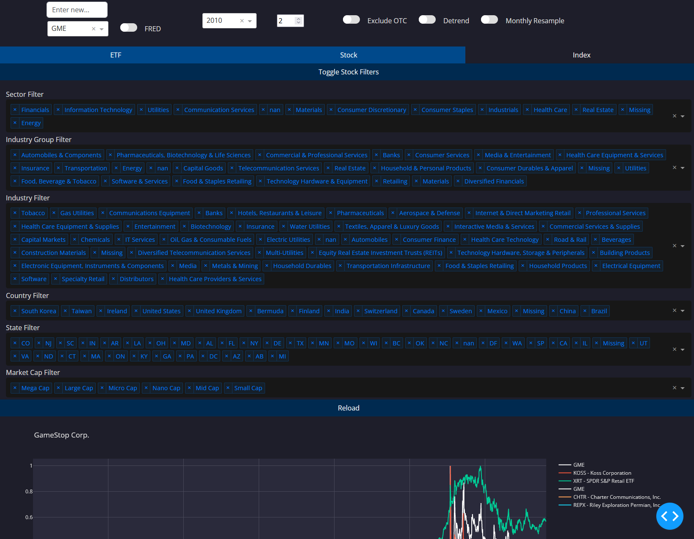

# SecuritiesCorrelations

The SecuritiesCorrelations project is a tool that provides insights into the correlations between different securities.
The project offers interactive visualizations and analysis of securities' relationships, helping users understand market
dynamics.

## Main Features:

1. Interactive Dashboard: The main_ui.py script provides an interactive dashboard, allowing users to
   visualize correlations between securities, revised economic metrics, and as-reported economic metrics.

2. Filtering Capabilities: Users can apply various filters to narrow down their analysis, such as ETF, Stock, Index, market cap, industry, and more.

3. Customizable Plots: The tool provides the ability to detrend data, resample on a monthly basis, adjust the start year, and add any financial instrument or metric's data to the plot for visual comparison.

## Setup

Make sure you've installed [conda](https://docs.conda.io/projects/conda/en/stable/user-guide/install/download.html) and created an environment for this application using python 3.10: 
```
conda create -n myenv python=3.10
```
Downloaded the repo:
```
git clone https://github.com/NoHedge/SecuritiesCorrelations.git
```
Activate your conda environment:
```
conda activate myenv
```
And install the requirements:

```
cd SecuritiesCorrelations
python -m pip install -r requirements.txt
```

Next run setup.py, it will download about 2gb of Stock, ETF, and Index data from Google Drive that is used to calculate
correlations.
```
python setup.py
```

Once the environment has been set up, navigate to the root directory of the project and run:

```
python main_ui.py
```
This will start the Dash server and the dashboard will be accessible in your browser at localhost:8080.
If you want to fetch data from the FRED API, get a [FRED API](https://fredaccount.stlouisfed.org/login/secure/)  key if you don't already have one, and set it in config.py.

## Running the Dashboard:

First time calculations will take a minute, but subsequent calculations will only take a few seconds due to caching data
retrieval. Once a calculation is made it should be saved to data/Graphs/pickled_security_correlations/.
Entering a ticker into the top "Enter New..." box will always calculate the correlation from scratch. Once a security has had its correlations calculated, it will appear in the "Securities" dropdown. You can recalculate correlations with the "Reload" button if desired.

When the switch next to "Enter New..." is set to "Add Series to Plot", the current plot will be kept and a new series will be added to it, including any metrics from the FRED website if you have set your API Key. For example if you want to overlay a GDP chart over AAPL you can enter "GDP" and press enter.   

Securities, FRED-MD, FRED API, and FRED API Unrevised buttons makes the dropdown show Securities or different macroeconomic indicators form the FRED-MD dataset that can be selected from.

The "Start Year" button will adjust from which starting point the correlation calculation begins.

The "Num Shown" input next to the year is the number of stocks to include in the plot.

"Exclude OTC" will exclude Pink Sheet Stocks.

"Detrend" will show the data as detrended (it is always calculated as detrended) so the user can get a better
visualization of the correlation.

"Monthly Resample" will show the data resampled into monthly granularity, mainly to help with visualizing FRED-MD data
which is only available monthly anyways.

Stock Filters is a list of filters that will only apply to stocks. Metadata is taken from FinanceDB, which has accurate
information for the majority of stocks but occasionally has "Missing" or "nan" values.

### Tips:

For easy access, you can make a shortcut for run.bat by right-clicking it and selecting "Create Shortcut", and adding it to your desktop.

Click on a security in the legend to hide it from the graph.

Modifying the plot using anything other than the filter options will reset the filters.

Click and drag on the plot to zoom in to select a time range to zoom in on. Double click to zoom back out.

Add FRED symbols to the 'data/FRED_all_series.txt' file to add to the dropdown of which FRED Series you can fetch.

As-Reported data correlations gives a better insight into what was truly following the movement. Fred api data allows for as-reported data as well as more granular data retrieval for series such as VIXCLSx.


## Future Enhancements:

Be able to calculate correlations for more recent timeframes, e.g. for the last month using 15-minute resolution data.

Add Crypto, Funds, and more macroeconomic data.

## Contributing:

Feel free to fork the repository and submit pull requests for any enhancements or bug fixes. I appreciate your
contribution.

## License:

This project is open source and available under the GNU General Public License.





### Notes:

This product uses the FRED® API but is not endorsed or certified by the Federal Reserve Bank of St. Louis.

By using this application, you are agreeing to be bound by the FRED® API Terms of Use.

In rare circumstances localhost:8080 might not work for you due to the port being in use by another process. In this
case find `port=int(os.environ.get('PORT', 8080)))` at the bottom of main_ui.py and change the port to another number.
